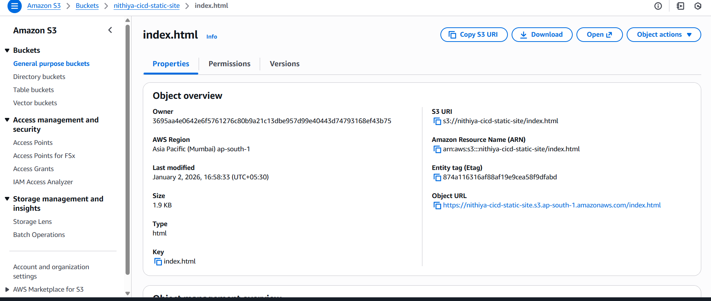

# aws-s3-cicd-static-website
Implemented a CI/CD pipeline where code changes pushed to GitHub are automatically deployed to an Amazon S3 static website using GitHub Actions and IAM role-based authentication

## Project Screenshots

### 1️⃣ GitHub Actions – CI/CD Success

### 2️⃣ S3 index file 

### 3️⃣ CloudFront output

